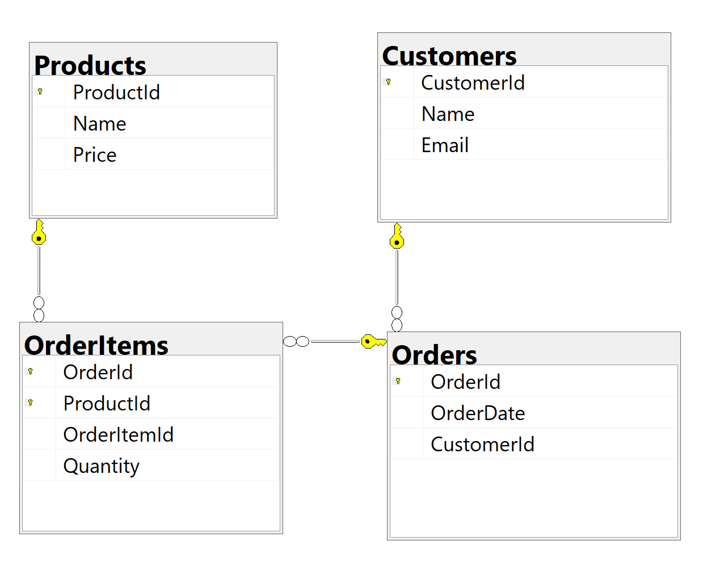
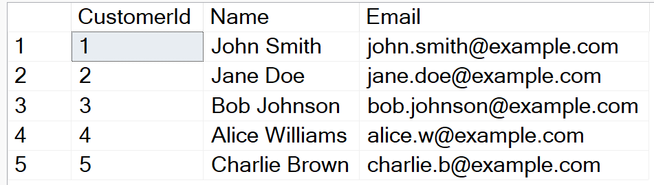
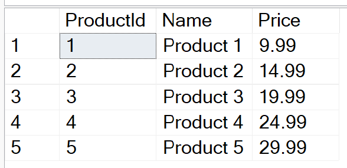
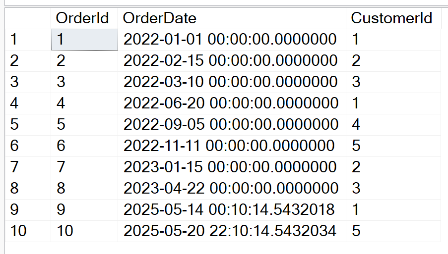
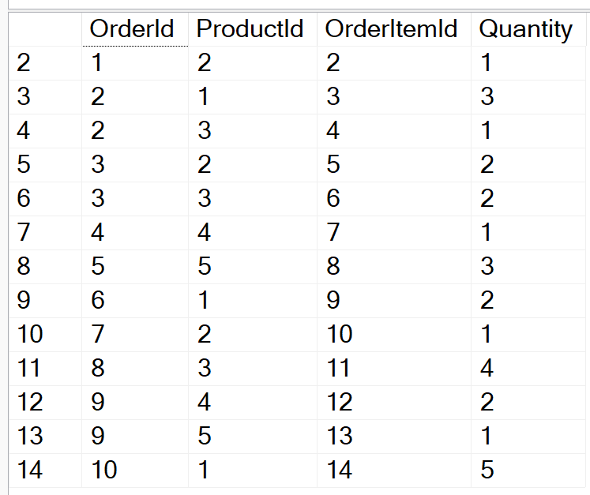
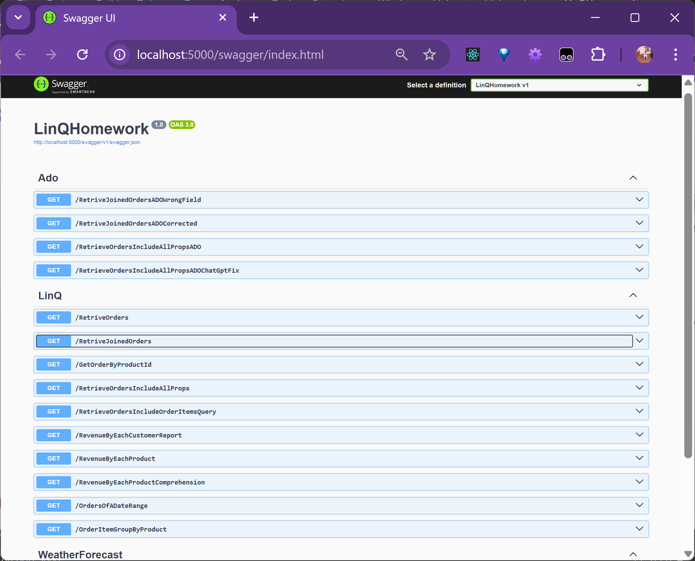

# LinQHomework

<div align="center">

### Database Schema Diagram
  
*Figure 1: Database schema diagram showing tables and relationships*

  
*Figure 2: Customer records*

  
*Figure 3: Product records*

  
*Figure 4: Order records*

  
*Figure 5: OrderItem records*


### API Documentation
  
*Figure 6: Auto-generated Swagger documentation for the API endpoints*

</div>

### LinQ controller methods with response
**http://localhost:5000/RetriveOrders**
```
[
  {
    "orderId": 1,
    "orderDate": "2022-01-01T00:00:00",
    "customerId": 1,
    "customer": null
  },
  {
    "orderId": 2,
    "orderDate": "2022-02-15T00:00:00",
    "customerId": 2,
    "customer": null
  },
  {
    "orderId": 3,
    "orderDate": "2022-03-10T00:00:00",
    "customerId": 3,
    "customer": null
  },
  {
    "orderId": 4,
    "orderDate": "2022-06-20T00:00:00",
    "customerId": 1,
    "customer": null
  },
  {
    "orderId": 5,
    "orderDate": "2022-09-05T00:00:00",
    "customerId": 4,
    "customer": null
  },
  {
    "orderId": 6,
    "orderDate": "2022-11-11T00:00:00",
    "customerId": 5,
    "customer": null
  },
  {
    "orderId": 7,
    "orderDate": "2023-01-15T00:00:00",
    "customerId": 2,
    "customer": null
  },
  {
    "orderId": 8,
    "orderDate": "2023-04-22T00:00:00",
    "customerId": 3,
    "customer": null
  },
  {
    "orderId": 9,
    "orderDate": "2025-05-14T00:10:14.5432018",
    "customerId": 1,
    "customer": null
  },
  {
    "orderId": 10,
    "orderDate": "2025-05-20T22:10:14.5432034",
    "customerId": 5,
    "customer": null
  }
]
```

**http://localhost:5000/RetriveJoinedOrders**
```
[
  {
    "order": {
      "orderId": 1,
      "orderDate": "2022-01-01T00:00:00",
      "customerId": 1,
      "customer": {
        "customerId": 1,
        "name": "John Smith",
        "email": "john.smith@example.com"
      }
    },
    "customer": {
      "customerId": 1,
      "name": "John Smith",
      "email": "john.smith@example.com"
    },
    "orderItem": {
      "orderItemId": 1,
      "orderId": 1,
      "order": {
        "orderId": 1,
        "orderDate": "2022-01-01T00:00:00",
        "customerId": 1,
        "customer": {
          "customerId": 1,
          "name": "John Smith",
          "email": "john.smith@example.com"
        }
      },
      "productId": 1,
      "product": {
        "productId": 1,
        "name": "Product 1",
        "price": 9.99
      },
      "quantity": 2
    },
    "product": {
      "productId": 1,
      "name": "Product 1",
      "price": 9.99
    }
  },
  {
    "order": {
      "orderId": 1,
      "orderDate": "2022-01-01T00:00:00",
      "customerId": 1,
      "customer": {
        "customerId": 1,
        "name": "John Smith",
        "email": "john.smith@example.com"
      }
    },
    "customer": {
      "customerId": 1,
      "name": "John Smith",
      "email": "john.smith@example.com"
    },
    "orderItem": {
      "orderItemId": 2,
      "orderId": 1,
      "order": {
        "orderId": 1,
        "orderDate": "2022-01-01T00:00:00",
        "customerId": 1,
        "customer": {
          "customerId": 1,
          "name": "John Smith",
          "email": "john.smith@example.com"
        }
      },
      "productId": 2,
      "product": {
        "productId": 2,
        "name": "Product 2",
        "price": 14.99
      },
      "quantity": 1
    },
    "product": {
      "productId": 2,
      "name": "Product 2",
      "price": 14.99
    }
  },
  {
    "order": {
      "orderId": 2,
      "orderDate": "2022-02-15T00:00:00",
      "customerId": 2,
      "customer": {
        "customerId": 2,
        "name": "Jane Doe",
        "email": "jane.doe@example.com"
      }
    },
    "customer": {
      "customerId": 2,
      "name": "Jane Doe",
      "email": "jane.doe@example.com"
    },
    "orderItem": {
      "orderItemId": 3,
      "orderId": 2,
      "order": {
        "orderId": 2,
        "orderDate": "2022-02-15T00:00:00",
        "customerId": 2,
        "customer": {
          "customerId": 2,
          "name": "Jane Doe",
          "email": "jane.doe@example.com"
        }
      },
      "productId": 1,
      "product": {
        "productId": 1,
        "name": "Product 1",
        "price": 9.99
      },
      "quantity": 3
    },
    "product": {
      "productId": 1,
      "name": "Product 1",
      "price": 9.99
    }
  },
  {
    "order": {
      "orderId": 2,
      "orderDate": "2022-02-15T00:00:00",
      "customerId": 2,
      "customer": {
        "customerId": 2,
        "name": "Jane Doe",
        "email": "jane.doe@example.com"
      }
    },
    "customer": {
      "customerId": 2,
      "name": "Jane Doe",
      "email": "jane.doe@example.com"
    },
    "orderItem": {
      "orderItemId": 4,
      "orderId": 2,
      "order": {
        "orderId": 2,
        "orderDate": "2022-02-15T00:00:00",
        "customerId": 2,
        "customer": {
          "customerId": 2,
          "name": "Jane Doe",
          "email": "jane.doe@example.com"
        }
      },
      "productId": 3,
      "product": {
        "productId": 3,
        "name": "Product 3",
        "price": 19.99
      },
      "quantity": 1
    },
    "product": {
      "productId": 3,
      "name": "Product 3",
      "price": 19.99
    }
  },
  {
    "order": {
      "orderId": 3,
      "orderDate": "2022-03-10T00:00:00",
      "customerId": 3,
      "customer": {
        "customerId": 3,
        "name": "Bob Johnson",
        "email": "bob.johnson@example.com"
      }
    },
    "customer": {
      "customerId": 3,
      "name": "Bob Johnson",
      "email": "bob.johnson@example.com"
    },
    "orderItem": {
      "orderItemId": 5,
      "orderId": 3,
      "order": {
        "orderId": 3,
        "orderDate": "2022-03-10T00:00:00",
        "customerId": 3,
        "customer": {
          "customerId": 3,
          "name": "Bob Johnson",
          "email": "bob.johnson@example.com"
        }
      },
      "productId": 2,
      "product": {
        "productId": 2,
        "name": "Product 2",
        "price": 14.99
      },
      "quantity": 2
    },
    "product": {
      "productId": 2,
      "name": "Product 2",
      "price": 14.99
    }
  },
  {
    "order": {
      "orderId": 3,
      "orderDate": "2022-03-10T00:00:00",
      "customerId": 3,
      "customer": {
        "customerId": 3,
        "name": "Bob Johnson",
        "email": "bob.johnson@example.com"
      }
    },
    "customer": {
      "customerId": 3,
      "name": "Bob Johnson",
      "email": "bob.johnson@example.com"
    },
    "orderItem": {
      "orderItemId": 6,
      "orderId": 3,
      "order": {
        "orderId": 3,
        "orderDate": "2022-03-10T00:00:00",
        "customerId": 3,
        "customer": {
          "customerId": 3,
          "name": "Bob Johnson",
          "email": "bob.johnson@example.com"
        }
      },
      "productId": 3,
      "product": {
        "productId": 3,
        "name": "Product 3",
        "price": 19.99
      },
      "quantity": 2
    },
    "product": {
      "productId": 3,
      "name": "Product 3",
      "price": 19.99
    }
  },
  {
    "order": {
      "orderId": 4,
      "orderDate": "2022-06-20T00:00:00",
      "customerId": 1,
      "customer": {
        "customerId": 1,
        "name": "John Smith",
        "email": "john.smith@example.com"
      }
    },
    "customer": {
      "customerId": 1,
      "name": "John Smith",
      "email": "john.smith@example.com"
    },
    "orderItem": {
      "orderItemId": 7,
      "orderId": 4,
      "order": {
        "orderId": 4,
        "orderDate": "2022-06-20T00:00:00",
        "customerId": 1,
        "customer": {
          "customerId": 1,
          "name": "John Smith",
          "email": "john.smith@example.com"
        }
      },
      "productId": 4,
      "product": {
        "productId": 4,
        "name": "Product 4",
        "price": 24.99
      },
      "quantity": 1
    },
    "product": {
      "productId": 4,
      "name": "Product 4",
      "price": 24.99
    }
  },
  {
    "order": {
      "orderId": 5,
      "orderDate": "2022-09-05T00:00:00",
      "customerId": 4,
      "customer": {
        "customerId": 4,
        "name": "Alice Williams",
        "email": "alice.w@example.com"
      }
    },
    "customer": {
      "customerId": 4,
      "name": "Alice Williams",
      "email": "alice.w@example.com"
    },
    "orderItem": {
      "orderItemId": 8,
      "orderId": 5,
      "order": {
        "orderId": 5,
        "orderDate": "2022-09-05T00:00:00",
        "customerId": 4,
        "customer": {
          "customerId": 4,
          "name": "Alice Williams",
          "email": "alice.w@example.com"
        }
      },
      "productId": 5,
      "product": {
        "productId": 5,
        "name": "Product 5",
        "price": 29.99
      },
      "quantity": 3
    },
    "product": {
      "productId": 5,
      "name": "Product 5",
      "price": 29.99
    }
  },
  {
    "order": {
      "orderId": 6,
      "orderDate": "2022-11-11T00:00:00",
      "customerId": 5,
      "customer": {
        "customerId": 5,
        "name": "Charlie Brown",
        "email": "charlie.b@example.com"
      }
    },
    "customer": {
      "customerId": 5,
      "name": "Charlie Brown",
      "email": "charlie.b@example.com"
    },
    "orderItem": {
      "orderItemId": 9,
      "orderId": 6,
      "order": {
        "orderId": 6,
        "orderDate": "2022-11-11T00:00:00",
        "customerId": 5,
        "customer": {
          "customerId": 5,
          "name": "Charlie Brown",
          "email": "charlie.b@example.com"
        }
      },
      "productId": 1,
      "product": {
        "productId": 1,
        "name": "Product 1",
        "price": 9.99
      },
      "quantity": 2
    },
    "product": {
      "productId": 1,
      "name": "Product 1",
      "price": 9.99
    }
  },
  {
    "order": {
      "orderId": 7,
      "orderDate": "2023-01-15T00:00:00",
      "customerId": 2,
      "customer": {
        "customerId": 2,
        "name": "Jane Doe",
        "email": "jane.doe@example.com"
      }
    },
    "customer": {
      "customerId": 2,
      "name": "Jane Doe",
      "email": "jane.doe@example.com"
    },
    "orderItem": {
      "orderItemId": 10,
      "orderId": 7,
      "order": {
        "orderId": 7,
        "orderDate": "2023-01-15T00:00:00",
        "customerId": 2,
        "customer": {
          "customerId": 2,
          "name": "Jane Doe",
          "email": "jane.doe@example.com"
        }
      },
      "productId": 2,
      "product": {
        "productId": 2,
        "name": "Product 2",
        "price": 14.99
      },
      "quantity": 1
    },
    "product": {
      "productId": 2,
      "name": "Product 2",
      "price": 14.99
    }
  },
  {
    "order": {
      "orderId": 8,
      "orderDate": "2023-04-22T00:00:00",
      "customerId": 3,
      "customer": {
        "customerId": 3,
        "name": "Bob Johnson",
        "email": "bob.johnson@example.com"
      }
    },
    "customer": {
      "customerId": 3,
      "name": "Bob Johnson",
      "email": "bob.johnson@example.com"
    },
    "orderItem": {
      "orderItemId": 11,
      "orderId": 8,
      "order": {
        "orderId": 8,
        "orderDate": "2023-04-22T00:00:00",
        "customerId": 3,
        "customer": {
          "customerId": 3,
          "name": "Bob Johnson",
          "email": "bob.johnson@example.com"
        }
      },
      "productId": 3,
      "product": {
        "productId": 3,
        "name": "Product 3",
        "price": 19.99
      },
      "quantity": 4
    },
    "product": {
      "productId": 3,
      "name": "Product 3",
      "price": 19.99
    }
  },
  {
    "order": {
      "orderId": 9,
      "orderDate": "2025-05-14T00:10:14.5432018",
      "customerId": 1,
      "customer": {
        "customerId": 1,
        "name": "John Smith",
        "email": "john.smith@example.com"
      }
    },
    "customer": {
      "customerId": 1,
      "name": "John Smith",
      "email": "john.smith@example.com"
    },
    "orderItem": {
      "orderItemId": 12,
      "orderId": 9,
      "order": {
        "orderId": 9,
        "orderDate": "2025-05-14T00:10:14.5432018",
        "customerId": 1,
        "customer": {
          "customerId": 1,
          "name": "John Smith",
          "email": "john.smith@example.com"
        }
      },
      "productId": 4,
      "product": {
        "productId": 4,
        "name": "Product 4",
        "price": 24.99
      },
      "quantity": 2
    },
    "product": {
      "productId": 4,
      "name": "Product 4",
      "price": 24.99
    }
  },
  {
    "order": {
      "orderId": 9,
      "orderDate": "2025-05-14T00:10:14.5432018",
      "customerId": 1,
      "customer": {
        "customerId": 1,
        "name": "John Smith",
        "email": "john.smith@example.com"
      }
    },
    "customer": {
      "customerId": 1,
      "name": "John Smith",
      "email": "john.smith@example.com"
    },
    "orderItem": {
      "orderItemId": 13,
      "orderId": 9,
      "order": {
        "orderId": 9,
        "orderDate": "2025-05-14T00:10:14.5432018",
        "customerId": 1,
        "customer": {
          "customerId": 1,
          "name": "John Smith",
          "email": "john.smith@example.com"
        }
      },
      "productId": 5,
      "product": {
        "productId": 5,
        "name": "Product 5",
        "price": 29.99
      },
      "quantity": 1
    },
    "product": {
      "productId": 5,
      "name": "Product 5",
      "price": 29.99
    }
  },
  {
    "order": {
      "orderId": 10,
      "orderDate": "2025-05-20T22:10:14.5432034",
      "customerId": 5,
      "customer": {
        "customerId": 5,
        "name": "Charlie Brown",
        "email": "charlie.b@example.com"
      }
    },
    "customer": {
      "customerId": 5,
      "name": "Charlie Brown",
      "email": "charlie.b@example.com"
    },
    "orderItem": {
      "orderItemId": 14,
      "orderId": 10,
      "order": {
        "orderId": 10,
        "orderDate": "2025-05-20T22:10:14.5432034",
        "customerId": 5,
        "customer": {
          "customerId": 5,
          "name": "Charlie Brown",
          "email": "charlie.b@example.com"
        }
      },
      "productId": 1,
      "product": {
        "productId": 1,
        "name": "Product 1",
        "price": 9.99
      },
      "quantity": 5
    },
    "product": {
      "productId": 1,
      "name": "Product 1",
      "price": 9.99
    }
  }
]
```

**http://localhost:5000/GetRecentOrders?days=2**
```
[
  {
    "orderId": 10,
    "orderDate": "2025-05-20T22:10:14.5432034",
    "customerName": "Charlie Brown",
    "itemsCount": 1
  }
]
```

**http://localhost:5000/GetOrdersByTimePeriod?period=year**
```
[
  {
    "orderId": 10,
    "orderDate": "2025-05-20T22:10:14.5432034",
    "customerId": 5,
    "customer": null
  },
  {
    "orderId": 9,
    "orderDate": "2025-05-14T00:10:14.5432018",
    "customerId": 1,
    "customer": null
  }
]
```

**http://localhost:5000/GetOrdersBetweenDates?fromDate=2000-05-14&toDate=2025-05-20**
```
[
  {
    "orderId": 1,
    "orderDate": "2022-01-01T00:00:00",
    "customer": "John Smith",
    "totalItems": 3,
    "totalValue": 34.97
  },
  {
    "orderId": 2,
    "orderDate": "2022-02-15T00:00:00",
    "customer": "Jane Doe",
    "totalItems": 4,
    "totalValue": 49.96
  },
  {
    "orderId": 3,
    "orderDate": "2022-03-10T00:00:00",
    "customer": "Bob Johnson",
    "totalItems": 4,
    "totalValue": 69.96
  },
  {
    "orderId": 4,
    "orderDate": "2022-06-20T00:00:00",
    "customer": "John Smith",
    "totalItems": 1,
    "totalValue": 24.99
  },
  {
    "orderId": 5,
    "orderDate": "2022-09-05T00:00:00",
    "customer": "Alice Williams",
    "totalItems": 3,
    "totalValue": 89.97
  },
  {
    "orderId": 6,
    "orderDate": "2022-11-11T00:00:00",
    "customer": "Charlie Brown",
    "totalItems": 2,
    "totalValue": 19.98
  },
  {
    "orderId": 7,
    "orderDate": "2023-01-15T00:00:00",
    "customer": "Jane Doe",
    "totalItems": 1,
    "totalValue": 14.99
  },
  {
    "orderId": 8,
    "orderDate": "2023-04-22T00:00:00",
    "customer": "Bob Johnson",
    "totalItems": 4,
    "totalValue": 79.96
  },
  {
    "orderId": 9,
    "orderDate": "2025-05-14T00:10:14.5432018",
    "customer": "John Smith",
    "totalItems": 3,
    "totalValue": 79.97
  }
]
```

**http://localhost:5000/GetOrderByProductId?productId=2**
```
[
  {
    "orderId": 1,
    "orderDate": "2022-01-01T00:00:00",
    "customerId": 1,
    "customer": null
  },
  {
    "orderId": 3,
    "orderDate": "2022-03-10T00:00:00",
    "customerId": 3,
    "customer": null
  },
  {
    "orderId": 7,
    "orderDate": "2023-01-15T00:00:00",
    "customerId": 2,
    "customer": null
  }
]
```

**http://localhost:5000/RetrieveOrdersIncludeAllProps**
Code:
```csharp
[HttpGet("[action]")]
        public async Task<IActionResult> RetrieveOrdersIncludeAllProps()
        {
            var orders = _context.Orders
                .Include(o => o.OrderItems)
                    .ThenInclude(oi => oi.Product)  // Product can only be accessed through OrderItem
                .Include(o => o.Customer)

                // create customized return object:
                .Select(o => new // .Select(o => new Order  // Order's OrderItem is JsonIgnored
                {
                    OrderId = o.OrderId,
                    OrderDate = o.OrderDate,
                    Customer = o.Customer,
                    OrderItems = o.OrderItems.Select(oi => new OrderItem
                    {
                        OrderItemId = oi.OrderItemId,
                        OrderId = oi.OrderId,
                        //ProductId = oi.ProductId,
                        Quantity = oi.Quantity,
                        Product = oi.Product    // object
                    }).ToList(),
                    Total = o.OrderItems.Sum(oi => oi.Quantity * oi.Product.Price)
                });


            #region compiled sql:
            //            SELECT[o].[OrderId], [o].[OrderDate], [c].[CustomerId], [c].[Email], [c].[Name], [t].[OrderItemId], [t].[OrderId], [t].[ProductId], [t].[Quantity], [t].[ProductId0], [t].[Name], [t].[Price], (
            //    SELECT COALESCE(SUM(CAST([o1].[Quantity] AS decimal(18, 2)) * [p0].[Price]), 0.0)
            //    FROM[OrderItems] AS[o1]
            //    INNER JOIN[Products] AS[p0] ON[o1].[ProductId] = [p0].[ProductId]
            //    WHERE[o].[OrderId] = [o1].[OrderId])
            //FROM[Orders] AS[o]
            //INNER JOIN[Customers] AS[c] ON[o].[CustomerId] = [c].[CustomerId]
            //LEFT JOIN(
            //    SELECT[o0].[OrderItemId], [o0].[OrderId], [o0].[ProductId], [o0].[Quantity], [p].[ProductId] AS[ProductId0], [p].[Name], [p].[Price]
            //    FROM [OrderItems] AS [o0]
            //    INNER JOIN [Products] AS[p] ON [o0].[ProductId] = [p].[ProductId]
            //) AS[t] ON[o].[OrderId] = [t].[OrderId]
            //ORDER BY[o].[OrderId], [c].[CustomerId], [t].[OrderId], [t].[ProductId]
            #endregion
            var sql = orders.ToQueryString();
            Console.WriteLine($"\n\n\nCompiled SQL: {sql}\n\n\n");
            var ordersList = await orders.ToListAsync();
            return Ok(orders);
        }
```
Response:
```
[
  {
    "orderId": 1,
    "orderDate": "2022-01-01T00:00:00",
    "customer": {
      "customerId": 1,
      "name": "John Smith",
      "email": "john.smith@example.com"
    },
    "orderItems": [
      {
        "orderItemId": 1,
        "orderId": 1,
        "order": null,
        "productId": 0,
        "product": {
          "productId": 1,
          "name": "Product 1",
          "price": 9.99
        },
        "quantity": 2
      },
      {
        "orderItemId": 2,
        "orderId": 1,
        "order": null,
        "productId": 0,
        "product": {
          "productId": 2,
          "name": "Product 2",
          "price": 14.99
        },
        "quantity": 1
      }
    ],
    "total": 34.97
  },
  {
    "orderId": 2,
    "orderDate": "2022-02-15T00:00:00",
    "customer": {
      "customerId": 2,
      "name": "Jane Doe",
      "email": "jane.doe@example.com"
    },
    "orderItems": [
      {
        "orderItemId": 3,
        "orderId": 2,
        "order": null,
        "productId": 0,
        "product": {
          "productId": 1,
          "name": "Product 1",
          "price": 9.99
        },
        "quantity": 3
      },
      {
        "orderItemId": 4,
        "orderId": 2,
        "order": null,
        "productId": 0,
        "product": {
          "productId": 3,
          "name": "Product 3",
          "price": 19.99
        },
        "quantity": 1
      }
    ],
    "total": 49.96
  },
  {
    "orderId": 3,
    "orderDate": "2022-03-10T00:00:00",
    "customer": {
      "customerId": 3,
      "name": "Bob Johnson",
      "email": "bob.johnson@example.com"
    },
    "orderItems": [
      {
        "orderItemId": 5,
        "orderId": 3,
        "order": null,
        "productId": 0,
        "product": {
          "productId": 2,
          "name": "Product 2",
          "price": 14.99
        },
        "quantity": 2
      },
      {
        "orderItemId": 6,
        "orderId": 3,
        "order": null,
        "productId": 0,
        "product": {
          "productId": 3,
          "name": "Product 3",
          "price": 19.99
        },
        "quantity": 2
      }
    ],
    "total": 69.96
  },
  {
    "orderId": 4,
    "orderDate": "2022-06-20T00:00:00",
    "customer": {
      "customerId": 1,
      "name": "John Smith",
      "email": "john.smith@example.com"
    },
    "orderItems": [
      {
        "orderItemId": 7,
        "orderId": 4,
        "order": null,
        "productId": 0,
        "product": {
          "productId": 4,
          "name": "Product 4",
          "price": 24.99
        },
        "quantity": 1
      }
    ],
    "total": 24.99
  },
  {
    "orderId": 5,
    "orderDate": "2022-09-05T00:00:00",
    "customer": {
      "customerId": 4,
      "name": "Alice Williams",
      "email": "alice.w@example.com"
    },
    "orderItems": [
      {
        "orderItemId": 8,
        "orderId": 5,
        "order": null,
        "productId": 0,
        "product": {
          "productId": 5,
          "name": "Product 5",
          "price": 29.99
        },
        "quantity": 3
      }
    ],
    "total": 89.97
  },
  {
    "orderId": 6,
    "orderDate": "2022-11-11T00:00:00",
    "customer": {
      "customerId": 5,
      "name": "Charlie Brown",
      "email": "charlie.b@example.com"
    },
    "orderItems": [
      {
        "orderItemId": 9,
        "orderId": 6,
        "order": null,
        "productId": 0,
        "product": {
          "productId": 1,
          "name": "Product 1",
          "price": 9.99
        },
        "quantity": 2
      }
    ],
    "total": 19.98
  },
  {
    "orderId": 7,
    "orderDate": "2023-01-15T00:00:00",
    "customer": {
      "customerId": 2,
      "name": "Jane Doe",
      "email": "jane.doe@example.com"
    },
    "orderItems": [
      {
        "orderItemId": 10,
        "orderId": 7,
        "order": null,
        "productId": 0,
        "product": {
          "productId": 2,
          "name": "Product 2",
          "price": 14.99
        },
        "quantity": 1
      }
    ],
    "total": 14.99
  },
  {
    "orderId": 8,
    "orderDate": "2023-04-22T00:00:00",
    "customer": {
      "customerId": 3,
      "name": "Bob Johnson",
      "email": "bob.johnson@example.com"
    },
    "orderItems": [
      {
        "orderItemId": 11,
        "orderId": 8,
        "order": null,
        "productId": 0,
        "product": {
          "productId": 3,
          "name": "Product 3",
          "price": 19.99
        },
        "quantity": 4
      }
    ],
    "total": 79.96
  },
  {
    "orderId": 9,
    "orderDate": "2025-05-14T00:10:14.5432018",
    "customer": {
      "customerId": 1,
      "name": "John Smith",
      "email": "john.smith@example.com"
    },
    "orderItems": [
      {
        "orderItemId": 12,
        "orderId": 9,
        "order": null,
        "productId": 0,
        "product": {
          "productId": 4,
          "name": "Product 4",
          "price": 24.99
        },
        "quantity": 2
      },
      {
        "orderItemId": 13,
        "orderId": 9,
        "order": null,
        "productId": 0,
        "product": {
          "productId": 5,
          "name": "Product 5",
          "price": 29.99
        },
        "quantity": 1
      }
    ],
    "total": 79.97
  },
  {
    "orderId": 10,
    "orderDate": "2025-05-20T22:10:14.5432034",
    "customer": {
      "customerId": 5,
      "name": "Charlie Brown",
      "email": "charlie.b@example.com"
    },
    "orderItems": [
      {
        "orderItemId": 14,
        "orderId": 10,
        "order": null,
        "productId": 0,
        "product": {
          "productId": 1,
          "name": "Product 1",
          "price": 9.99
        },
        "quantity": 5
      }
    ],
    "total": 49.95
  }
]
```

**http://localhost:5000/RevenueByEachCustomerReport**
```
[
  {
    "customerName": "Alice Williams",
    "revenue": 89.97
  },
  {
    "customerName": "Bob Johnson",
    "revenue": 69.96
  },
  {
    "customerName": "John Smith",
    "revenue": 59.96
  },
  {
    "customerName": "Jane Doe",
    "revenue": 49.96
  },
  {
    "customerName": "Charlie Brown",
    "revenue": 19.98
  }
]
```

**http://localhost:5000/RevenueByEachProduct**
```
[
  {
    "productName": "Product 3",
    "revenue": 139.93
  },
  {
    "productName": "Product 5",
    "revenue": 119.96
  },
  {
    "productName": "Product 1",
    "revenue": 119.88
  },
  {
    "productName": "Product 4",
    "revenue": 74.97
  },
  {
    "productName": "Product 2",
    "revenue": 59.96
  }
]
```

**http://localhost:5000/OrdersOfADateRange**
```
[
  {
    "customerName": "John Smith",
    "totalRevenue": 34.97
  }
]
```
